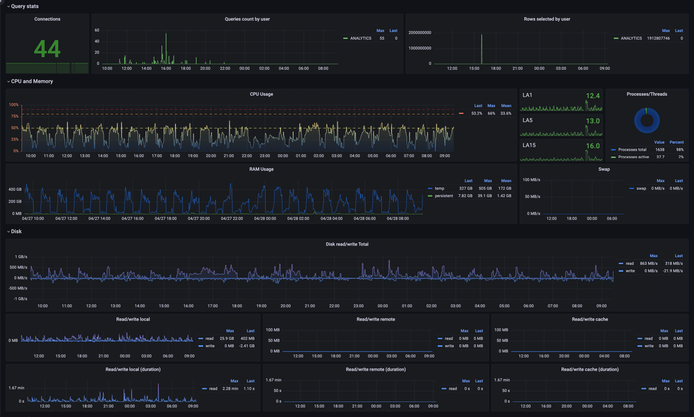

# Prometheus exasol-exporter

Based on [ncabatoff DBMS Exporter](https://github.com/ncabatoff/dbms_exporter)

## Usage

### Running docker container
First you need to determine `DATA_SOURCE_NAME` environment variable 
```bash
git clone https://github.com/s3kkt/exasol-exporter.git && cd exasol-exporter
docker run --platform=linux/amd64 \
  -p 9113:9113 \
  -v $(pwd)/examples/query.yml:/etc/query.yml \
  --rm s3kkt/exasol-exporter \
  -driver odbc -queryfile /etc/query.yml
```

### Custom metrics

## Grafana dashboard
You can build your own dashboard or use prebuilt JSON file [examples/dashboard.json](./examples/dashboard.json) from examples directory.
Example dashboard based on metrics from [examples/query.yml](./examples/query.yml) and looks like shown below:
